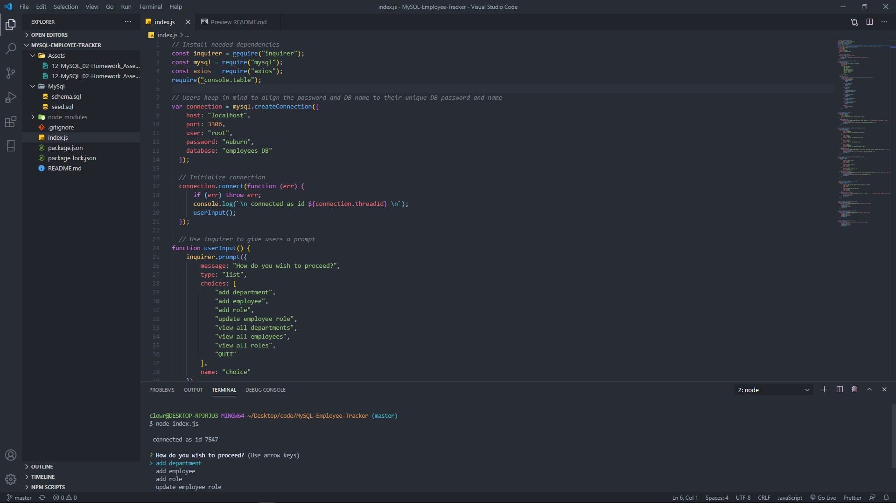
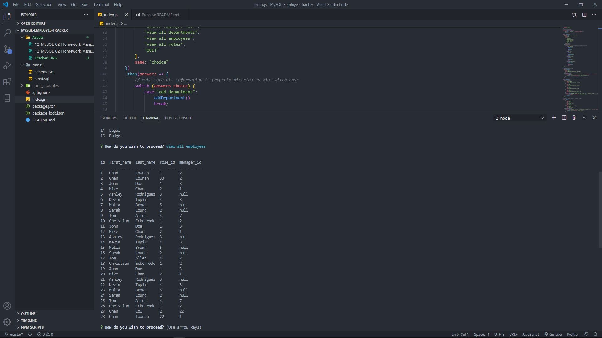
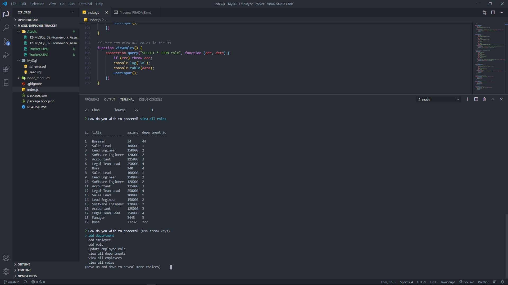

# MySQL-Employee-Tracker


The following is a command line application that will allow for users to create and update information related to running a business via MySQL. Users are able to enter information regarding new departments, roles, and employees and then access or edit this subsequent information via the command line. Technologies used to create this app include; Node.js, MySQL, and more. This app can be accessed by downloading this repository, and running npm install in the command line. Simply enter "node index.js" to begin running the app following your download of the neccessary dependencies. To view this application in action please follow this link: https://drive.google.com/file/d/1H4HO7wsW4PvEtIkfDfQ4UpGqAMPbQTW9/view?usp=sharing

## Description

Build a command-line application that at a minimum allows the user to:

- Add departments, roles, employees

- View departments, roles, employees

- Update employee roles

Bonus points if you're able to:

- Update employee managers

- View employees by manager

- Delete departments, roles, and employees

## User Story

```
As a business owner
I want to be able to view and manage the departments, roles, and employees in my company
So that I can organize and plan my business
```

## Table of Contents


* [License](#license)
* [Questions](#questions)
* [Contributors](#contributors)
* [Media](#media)

# License

Application working under an MIT license

# Questions

Reach out to me via email regarding any questions or concerns with this project:
- chandler.lowrance1@gmail.com


# Contributors

| Chandler
------------ 

[<br /><sub><b>Chandler Lowrance</b></sub>](https://github.com/Chandler8)<br />[💻](https://github.com/Chandler8?tab=repositories "Repositories")

# Media





Link to video showcasing functionality
- https://drive.google.com/file/d/1H4HO7wsW4PvEtIkfDfQ4UpGqAMPbQTW9/view?usp=sharing